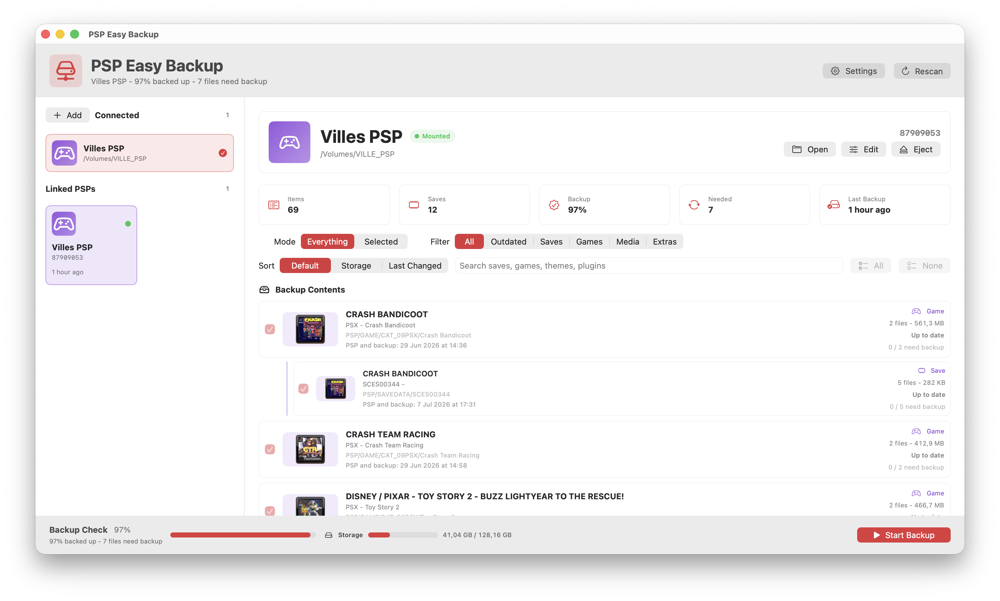
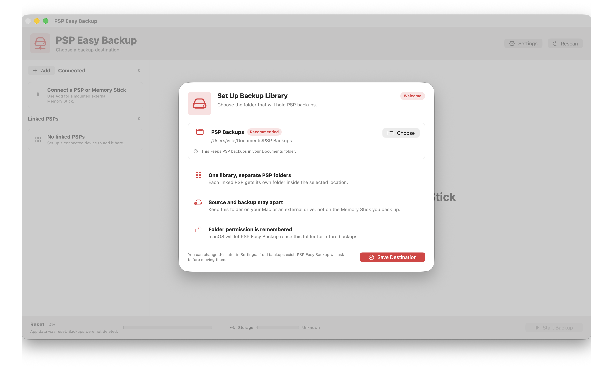
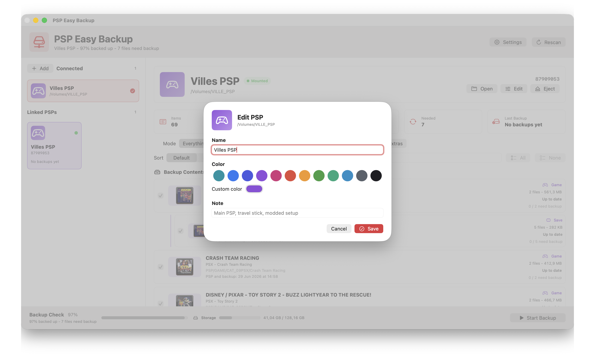
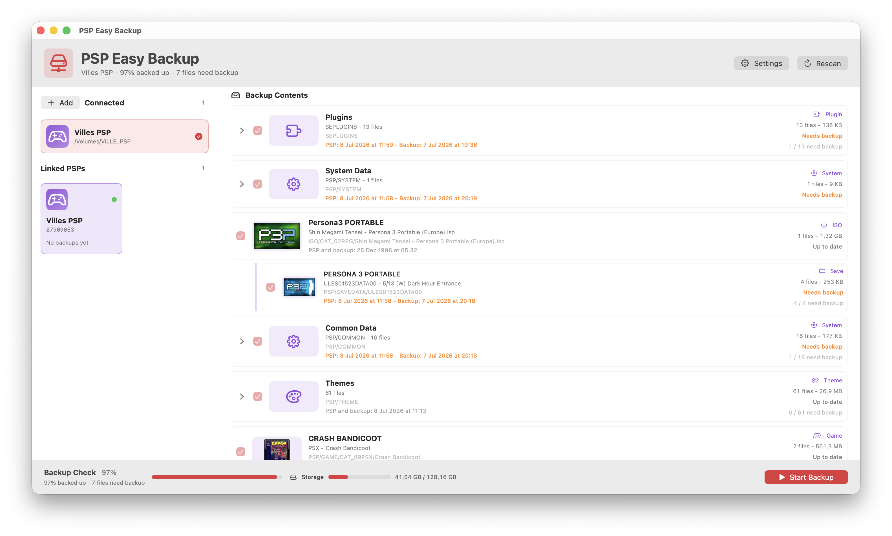
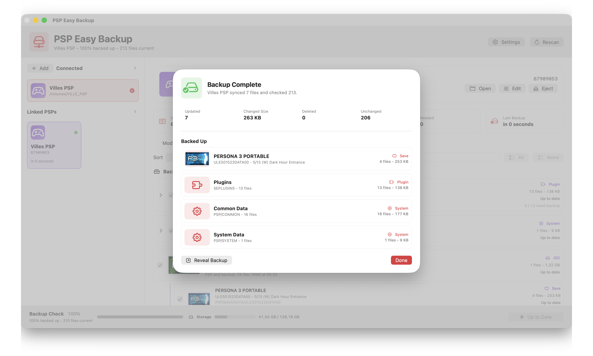

# PSP Easy Backup 🎮💾

PSP Easy Backup is a macOS app for backing up PSP Memory Sticks with a clean visual interface. It detects PSP volumes, links each PSP to its own profile, scans saves/games/media, and keeps an incremental backup on your Mac or external drive.

> macOS 14 or newer. Distributed as a signed and notarized `.dmg`.

## ✨ Features

- 🔍 Auto-detects mounted PSPs and Memory Sticks with a `PSP` folder.
- ➕ Lets you manually add a mounted external Memory Stick.
- 🏷️ Links each PSP with a name, color, note, and device marker.
- 📚 Uses one backup library with separate folders for each PSP.
- 🧩 Finds saves, games, ISOs, themes, plugins, cheats, media, system data, folders, and loose files.
- 🖼️ Reads PSP titles and icons from `PARAM.SFO`, `EBOOT.PBP`, and ISO metadata when available.
- ✅ Shows what is up to date, new, or needs backup.
- 💾 Supports **Everything** and **Selected** backup modes.
- ⚡ Copies only new or changed files.
- 🧹 Removes stale files from the backup mirror.
- 📴 Shows linked PSP backups even when the PSP is offline.
- 📊 Shows progress, storage use, last seen time, and last backup time.
- 📁 Opens backup folders in Finder.
- ⏏️ Ejects connected PSPs or Memory Sticks from the app.

## 📸 Screenshots











## 🚀 Install

1. Download the latest `PSP Easy Backup.dmg` from GitHub Releases.
2. Open the `.dmg`.
3. Drag **PSP Easy Backup.app** into the **Applications** folder.
4. Open the app from Applications.
5. Choose a backup library folder.
6. Connect your PSP in USB Connection mode, or insert the Memory Stick with a card reader.

The app is signed and notarized for macOS, so there should be no unsigned-app warning.

## 🕹️ How To Use

1. Launch **PSP Easy Backup**.
2. Choose a backup library. The default is:

   ```text
   ~/Documents/PSP Backups
   ```

3. Connect a PSP or Memory Stick that contains a `PSP` folder.
4. Click **Setup This Device** the first time a PSP appears.
5. Choose **Everything** to mirror the whole Memory Stick, or **Selected** to back up specific content.
6. Click **Start Backup**.
7. Use **Reveal Backup** or **Open Backups** to view files in Finder.

## 🧩 Supported Content

- Saves: `PSP/SAVEDATA`
- Games and homebrew: `PSP/GAME`
- Disc images: `.iso`, `.cso`, `.dax` in `ISO`
- Themes: `PSP/THEME`
- Plugins: `SEPLUGINS`, `seplugins`, `plugins`
- Cheats: `cheats`, `PSP/CHEATS`
- Media: `MUSIC`, `PICTURE`, `VIDEO`, `MP_ROOT`, and PSP media folders
- System/common data: `PSP/SYSTEM`, `PSP/COMMON`, `PSP/RSSCH`
- Other root files on the Memory Stick

## 💾 Backup Layout

Backups are stored as a readable mirror:

```text
PSP Backups/
  My PSP-AB12CD34/
    PSP Contents/
      PSP/
      ISO/
      MUSIC/
      ...
    Logs/
      Backup_YYYY-MM-DD_HH-mm-ss.log
    .psp-easy-backup-summary.json
    contents-manifest.json
```

PSP Easy Backup preserves modification dates, skips unchanged files, writes logs/manifests, and prevents unsafe backup locations like placing the backup inside the PSP source.

## 🧠 App Data

When a PSP is linked, this marker is written to the Memory Stick root:

```text
.psp-easy-backup-device.json
```

Local settings, linked PSP profiles, and cached artwork are stored here:

```text
~/Library/Application Support/PSP Easy Backup/
```

## 🛡️ Privacy

- No account required.
- No internet required for backup features.
- No telemetry.
- Backups stay in the folder you choose.

## ⚠️ Notes

- macOS only.
- The PSP or Memory Stick must mount as a normal volume with a `PSP` folder.
